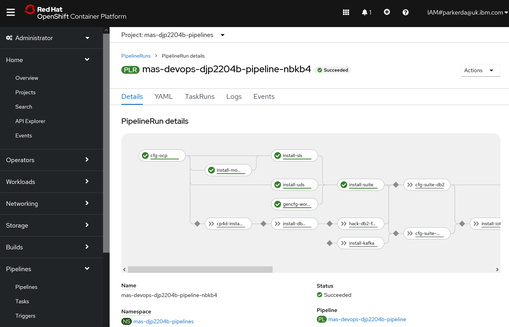
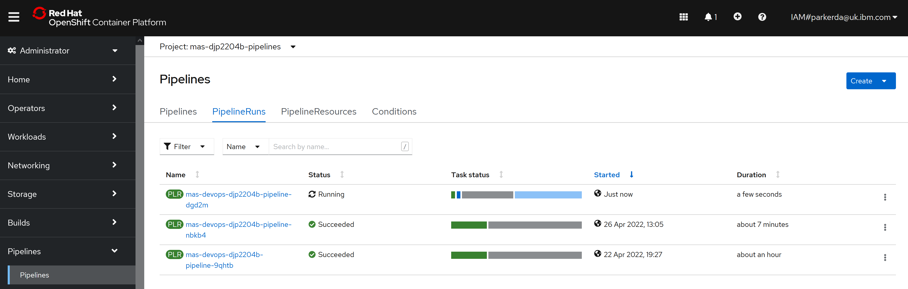

# One-Click MAS Installer

The install itself is performed inside your RedHat OpenShift cluster utilizing [Openshift Pipelines](https://cloud.redhat.com/learn/topics/ci-cd)

> OpenShift Pipelines is a Kubernetes-native CI/CD solution based on Tekton. It builds on Tekton to provide a CI/CD experience through tight integration with OpenShift and Red Hat developer tools. OpenShift Pipelines is designed to run each step of the CI/CD pipeline in its own container, allowing each step to scale independently to meet the demands of the pipeline.

The engine that performs the installation is written in Ansible, and you can directly use the same automtion outside of this installer if you wish.  The code is open source and available in [GitHub](https://github.com/ibm-mas/ansible-devops), the collection is also available to install directly from [Ansible Galaxy](https://galaxy.ansible.com/ibm/mas_devops).

There are minimal dependencies to meet on your own computer:
- Bash
- OpenShift client
- Network access to the OpenShift cluster

Alternatively run the install from inside our docker container image: `docker run -ti quay.io/ibmmas/installer`

The install is designed to work on any OCP cluster, but has been specifically tested in these environments:
- IBMCloud ROKS
- Azure
- IBM DevIT Fyre (internal)

## One-Click Install
All settings can be controlled via environment variables to avoid needing to manually type them out, for example if you `export MAS_ENTITLEMENT_KEY=xxxx` then when you run the install that input will be prefilled with the value from the environment variable, allowing you to press Enter to continue, or modify the value if you need to.

The installers supports:
- IBM Operator Catalog Configuration
- Required Dependency Installation:
  - MongoDb
  - IBM Suite License Service
  - IBM User Data Services
  - IBM Certificate Manager
  - Service Binding Operator
- Optional Dependency Installation:
  - Apache Kafka
  - IBM Db2
  - IBM Cloud Pak for Data
    - [Watson Discovery](https://www.ibm.com/docs/en/cloud-paks/cp-data/4.0?topic=services-watson-discovery)
    - [Watson Studio](https://www.ibm.com/docs/en/cloud-paks/cp-data/4.0?topic=services-watson-studio)
    - [Watson Machine Learning](https://www.ibm.com/docs/en/cloud-paks/cp-data/4.0?topic=services-watson-machine-learning)
    - [Watson OpenScale](https://www.ibm.com/docs/en/cloud-paks/cp-data/4.0?topic=services-watson-openscale)
    - [Analytics Engine (Apache Spark)](https://www.ibm.com/docs/en/cloud-paks/cp-data/4.0?topic=services-analytics-engine-powered-by-apache-spark)
- Suite Core Services Installation
- Suite Application Installation:
  - IoT
  - Manage
  - Monitor
  - MSO
  - Predict
  - Safety

The installer will automatically provision and set up the required dependencies based on the applications that you select to install.

The install can be launched with the command `mas install`.  The end result will be a pipeline run being started in your target cluster where you can track the progress of the installation.

## Air Gap Support
Three commands are available to aid in the deployment of an Air Gap MAS installation.

- `mas setup-registry` will deploy a private docker registry on an OCP cluster suitable for hosting a mirror of all container images used in a MAS installation
- `mas mirror-images` will mirror all (or a subset) container images needed for a MAS installation to your private registry
- `mas configure-airgap` will configure your target OCP cluster to use a private docker register and will install the operator catalogs required by MAS from that mirror

**Important:** `mas configure-airgap` does not work for IBMCloud ROKS clusters.  This is a limitation of the service provided in IBMCloud which disables key parts of OpenShift functionality required to configure and use ImageContentSourcePolicy resources (which is the basis of airgap/image mirroring support in OpenShift).

Once these steps have been completed, you should be able to run a "normal" MAS install on the target cluster (`mas install`).

## Mustgather
The pipeline sets a "finally" block that is executed at the end of the steps regardless of success or failure. Inside this finally block the **mustgather** ClusterTask is executed which runs the IBM AI Applications' Must Gather tool against a MAS instance. It uses the mustgather workspace to persist the output into a Persistent Volume for retrieval after the pipeline has completed.

Users can then use the **ibm.mas_devops.suite_mustgather_download** playbook locally to pull the mustgather output from the persistent volume.

Note: The **mustgather** clusterTask will clear any previous content found in the `/workspace/mustgather` persistent volume before each call to the mustgather playbook. This is to ensure that the persistent volume does not become full after multiple runs using the same persistent volume/namespace.

## OpenShift Cluster Provisioning
- `scripts/mas-provision-roks` (still to be integrated into the CLI)
- `mas provision-fyre`
