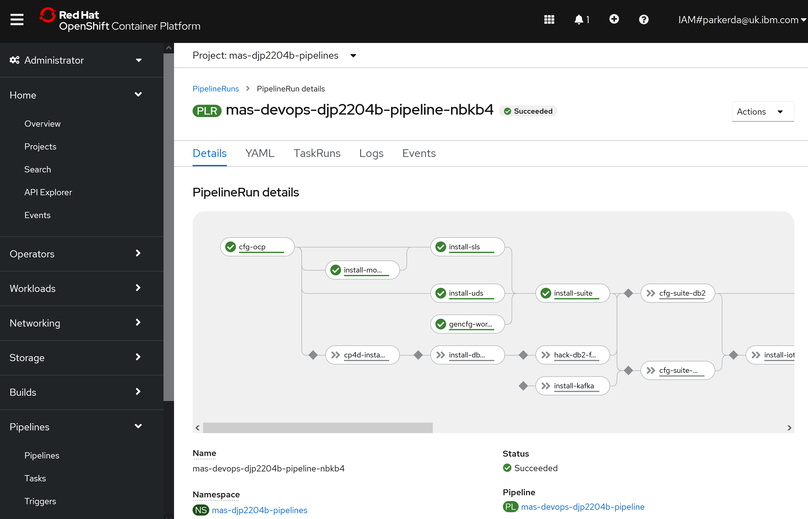

Install
===============================================================================

Usage
-------------------------------------------------------------------------------
`mas install [options]`

### Catalog Selection (Required):
- `-c, --mas-catalog-version MAS_CATALOG_VERSION` IBM Maximo Operator Catalog to install (e.g. v8-amd64)

### Entitlement & Licensing (Required):
- `--ibm-entitlement-key IBM_ENTITLEMENT_KEY`  IBM entitlement key
- `--license-id SLS_LICENSE_ID`                MAS license ID
- `--license-file SLS_LICENSE_FILE_LOCAL`      Path to MAS license file
- `--uds-email UDS_CONTACT_EMAIL`              Contact e-mail address
- `--uds-firstname UDS_CONTACT_FIRSTNAME`      Contact first name
- `--uds-lastname UDS_CONTACT_LASTNAME`        Contact last name

### Storage Class Selection (Required):
- `--storage-rwo STORAGE_CLASS_RWO`                   Read Write Once (RWO) storage class (e.g. ibmc-block-gold)
- `--storage-rwx STORAGE_CLASS_RWX`                   Read Write Many (RWX) storage class (e.g. ibmc-file-gold-gid)
- `--storage-pipeline PIPELINE_STORAGE_CLASS`         Install pipeline storage class (e.g. ibmc-file-gold-gid)
- `--storage-accessmode PIPELINE_STORAGE_ACCESSMODE`  Install pipeline storage class access mode (ReadWriteMany or ReadWriteOnce)

### Maximo Application Suite Instance (Required):
- `-i, --mas-instance-id MAS_INSTANCE_ID`             MAS Instance ID
- `-w, --mas-workspace-id MAS_WORKSPACE_ID`           MAS Workspace ID
- `-W, --mas-workspace-name MAS_WORKSPACE_ID`         MAS Workspace Name

### Advanced MAS Configuration (Optional):
- `--additional-configs LOCAL_MAS_CONFIG_DIR`         Path to a directory containing additional configuration files to be applied
- `--non-prod`                                        Install MAS in Non-production mode

### Maximo Application Suite Core Platform (Required):
- `--mas-channel MAS_CHANNEL`                                    Subscription channel for the Core Platform

### Maximo Application Suite Application Selection (Optional):
- `--iot-channel MAS_APP_CHANNEL_IOT`                            Subscription channel for Maximo IoT
- `--monitor-channel MAS_APP_CHANNEL_MONITOR`                    Subscription channel for Maximo Monitor
- `--manage-channel MAS_APP_CHANNEL_MANAGE`                      Subscription channel for Maximo Manage
- `--manage-jdbc MAS_APPWS_BINDINGS_JDBC_MANAGE`                 Configure Maximo Manage JDBC binding (workspace-application or system)
- `--predict-channel MAS_APP_CHANNEL_PREDICT`                    Subscription channel for Maximo Predict
- `--assist-channel MAS_APP_CHANNEL_ASSIST`                      Subscription channel for Maximo Assist
- `--visualinspection-channel MAS_APP_CHANNEL_VISUALINSPECTION`  Subscription channel for Maximo Visual Inspection
- `--optimizer-channel MAS_APP_CHANNEL_OPTIMIZER`                Subscription channel for Maximo optimizer
- `--optimizer-plan MAS_APP_PLAN_OPTIMIZER`                      Installation plan for Maximo Optimizer (full or limited)

### IBM Cloud Pak for Data (Required when installing Predict or Assist):
- `--cp4d-version CP4D_VERSION`                                  Product version of CP4D to use

### IBM Db2 (Optional, required to use IBM Db2 Universal Operator):
- `--db2u-channel DB2_CHANNEL`     Subscription channel for Db2u (e.g. v110508.0)
- `--db2u-system`                  Install a shared Db2u instance for MAS (required by IoT & Monitor, supported by Manage)
- `--db2u-manage`                  Install a dedicated Db2u instance for Maximo Manage (supported by Manage)

### Advanced Db2u Universal Operator Configuration (Optional):
- `--db2u-namespace DB2_NAMESPACE` Change namespace where Db2u instances will be created

### Advanced Db2u Universal Operator Configuration - Node Scheduling (Optional):
- `--db2u-affinity-key DB2_AFFINITY_KEY`             Set a node label to declare affinity to
- `--db2u-affinity-value DB2_AFFINITY_VALUE`         Set the value of the node label to affine with
- `--db2u-tolerate-key DB2_TOLERATE_KEY`             Set a node taint to tolerate
- `--db2u-tolerate-value DB2_TOLERATE_VALUE`         Set the value of the taint to tolerate
- `--db2u-tolerate-effect DB2_TOLERATE_EFFECT`       Set the effect that will be tolerated (NoSchedule, PreferNoSchedule, or NoExecute)

### Advanced Db2u Universal Operator Configuration - Resource Requests (Optional):
- `--db2u-cpu-request DB2_CPU_REQUESTS`              Customise Db2 CPU request
- `--db2u-cpu-limit DB2_CPU_LIMITS`                  Customise Db2 CPU limit
- `--db2u-memory-request DB2_MEMORY_REQUESTS`        Customise Db2 memory request
- `--db2u-memory-limit DB2_MEMORY_LIMITS`            Customise Db2 memory limit

### Advanced Db2u Universal Operator Configuration - Storage (Optional):
- `--db2u-backup-storage DB2_BACKUP_STORAGE_SIZE`    Customise Db2 storage capacity
- `--db2u-data-storage DB2_DATA_STORAGE_SIZE`        Customise Db2 storage capacity
- `--db2u-logs-storage DB2_LOGS_STORAGE_SIZE`        Customise Db2 storage capacity
- `--db2u-meta-storage DB2_META_STORAGE_SIZE`        Customise Db2 storage capacity
- `--db2u-temp-storage DB2_TEMP_STORAGE_SIZE`        Customise Db2 storage capacity

### Other Commands:
- `--no-wait-for-pvcs` If you are using using storage classes that utilize 'WaitForFirstConsumer' binding mode use this flag
- `--no-confirm`       Mirror images without prompting for confirmation
- `-h, --help`         Show install help message


Examples
-------------------------------------------------------------------------------
### Non-Interactive
```bash
docker run -ti --rm -v ~:/mnt/home --pull always quay.io/ibmmas/cli
export ENTITLEMENT_KEY=xxx
mas install -i mas1 -w ws1 -W "My Workspace" -c v8-amd64 --mas-channel 8.10.x \
  --ibm-entitlement-key $ENTITLEMENT_KEY \
  --license-id xxxxxxxxxxxx --license-file /mnt/home/entitlement.lic \
  --uds-email myemail@email.com --uds-firstname John --uds-lastname Barnes \
  --storage-rwo ibmc-block-gold --storage-rwx ibmc-file-gold-gid \
  --storage-pipeline ibmc-file-gold-gid --storage-accessmode ReadWriteMany \
  --no-confirm
```

### Interactive

```bash
docker run -ti --rm -v ~:/mnt/home --pull always quay.io/ibmmas/cli
mas install
```

!!! important
    We will need the `entitlement.lic` file to perform the installation which is why we mount your home directory into the container.  If you saved the entitlement file elsewhere, mount that directory instead.

    When prompted you will be able to set license file to `/mnt/home/entitlement.lic`


Air Gap Support
-------------------------------------------------------------------------------
If you have already ran `mas configure-airgap` to install the ImageContentSourcePolicy for IBM Maximo Application Suite then the installer will automatically detect the presence of this and tailor the installation configuration for a disconnected installation.

A number of applications are not currently available when using a private mirror registry in this fashion, as a result you will not be asked whether you wish to install these applications:

- Maximo Assist
- Maximo Health & Predict Utilities
- Maximo Predict
- Maximo Visual Inspection


More Information
-------------------------------------------------------------------------------
The install is designed to work on any OCP cluster, but has been specifically tested in these environments:

- IBMCloud ROKS
- Microsoft Azure
- AWS ROSA
- IBM DevIT FYRE (internal)

### The Automation Engine
The engine that performs all tasks is written in Ansible, you can directly use the same automation outside of this CLI if you wish.  The code is open source and available in [ibm-mas/ansible-devops](https://github.com/ibm-mas/ansible-devops), the collection is also available to install directly from Ansible Galaxy:

- [Ansible Galaxy: ibm.mas_devops](https://galaxy.ansible.com/ibm/mas_devops)

### The Automation Driver
The install is performed inside your RedHat OpenShift cluster utilizing [Openshift Pipelines](https://cloud.redhat.com/learn/topics/ci-cd)

> OpenShift Pipelines is a Kubernetes-native CI/CD solution based on Tekton. It builds on Tekton to provide a CI/CD experience through tight integration with OpenShift and Red Hat developer tools. OpenShift Pipelines is designed to run each step of the CI/CD pipeline in its own container, allowing each step to scale independently to meet the demands of the pipeline.



### Support
The installer supports:

- IBM Maximo Operator Catalog installation
- Required dependency installation:
    - MongoDb
    - IBM Suite License Service
    - IBM User Data Services
    - IBM Certificate Manager
- Optional dependency installation:
    - Apache Kafka
    - IBM Db2
    - IBM Cloud Pak for Data Platform and Services
        - [Watson Discovery](https://www.ibm.com/docs/en/cloud-paks/cp-data/4.0?topic=services-watson-discovery)
        - [Watson Studio](https://www.ibm.com/docs/en/cloud-paks/cp-data/4.0?topic=services-watson-studio)
        - [Watson Machine Learning](https://www.ibm.com/docs/en/cloud-paks/cp-data/4.0?topic=services-watson-machine-learning)
        - [Watson OpenScale](https://www.ibm.com/docs/en/cloud-paks/cp-data/4.0?topic=services-watson-openscale)
        - [Analytics Engine (Apache Spark)](https://www.ibm.com/docs/en/cloud-paks/cp-data/4.0?topic=services-analytics-engine-powered-by-apache-spark)
- Suite core services installation
- Suite application installation

The installer will automatically provision and set up the required dependencies based on the applications that you select to install.

The install can be launched with the command `mas install`.  The end result will be a pipeline run started in your target cluster where you can track the progress of the installation.


