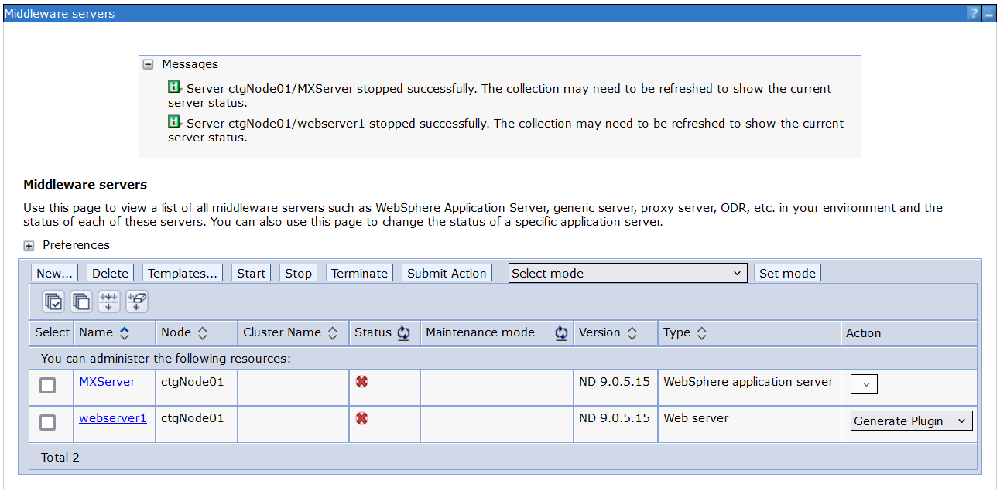
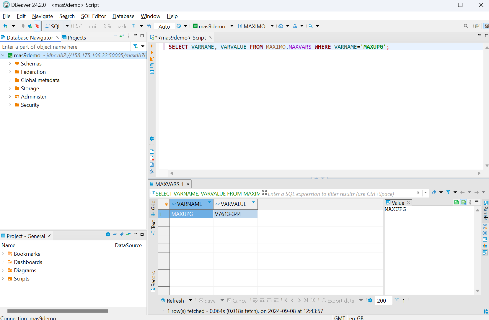
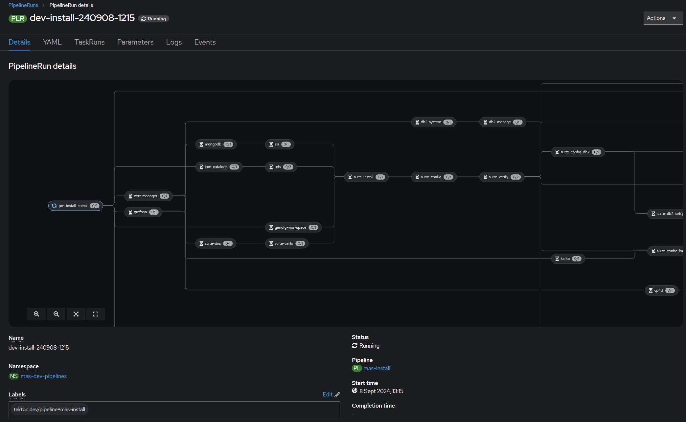
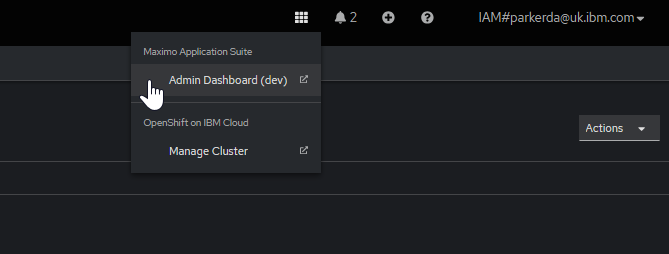

Migration from EAM 7 to MAS 9
===============================================================================

This example demonstrates how to migrate from EAM 7 to Maximo Manage v9 running on [Red Hat OpenShift on IBM Cloud](https://www.ibm.com/products/openshift) (ROKS).

- For this demo we are using an existing database instance that is configured without TLS enabled (so we do not need to worry about providing the certificates in the configuration)
- Normally you would take a backup of the database and use that, but for the purpose of this example we are going to take over the database currently in use, if you wish to follow this example using a restored backup of your database simply skip step 2.


Prerequisites
-------------------------------------------------------------------------------

**1 An IBMCloud API Key**

- Login in your IBM Cloud account
- Go to **Manage** menu and select **Access (IAM)**
- Go to **API keys** menu, click **Create an IBM Cloud API key**
- Enter a name and description for your API Key and click **Create**

**2 A MAS License File**

Access [IBM License Key Center](https://licensing.subscribenet.com/control/ibmr/login), on the **Get Keys** menu select **IBM AppPoint Suites**. Select **IBM MAXIMO APPLICATION SUITE AppPOINT LIC** and on the next page fill in the information as below:

| Field          | Content |
| -------------- | ------- |
| Number of Keys | How many AppPoints to assign to the license file |
| Host ID Type   | Set to Ethernet Address |
| Host ID        | Enter any 12 digit hexadecimal string |
| Hostname       | Set to the hostname of your OCP instance, but this can be any value really |
| Port           | Set to 27000 |

Create a new folder `mas9demo` in your home directory and save this file there as `~/mas9demo/entitlement.lic`

**3 An IBM Entitlement Key**

Access [IBM Container Software Library](https://myibm.ibm.com/products-services/containerlibrary) using your IBMId to obtain your entitlement key.


Step 1 - Provision OpenShift
-------------------------------------------------------------------------------
We are going to provision the cluster using **Red Hat OpenShift on IBM Cloud** via the MAS CLI container image.  Ensure that you set the `IBMCLOUD_APIKEY` environment variable to the key you obtained from the [IBM Container Software Library](https://myibm.ibm.com/products-services/containerlibrary).


```bash
export IBMCLOUD_APIKEY=x

docker run -e IBMCLOUD_APIKEY -ti --rm -v ~:/mnt/home --pull always quay.io/ibmmas/cli:@@CLI_LATEST_VERSION@@ \
  mas provision-roks -r mas-development -c mas9demo -v 4.14_openshift \
  --worker-count 3 --worker-flavor b3c.8x32 --worker-zone lon02 \
  --no-confirm
```

This will provision an OpenShift cluster with three 8x32 worker nodes. It will take approximately **1 hour** to provision the cluster.

!!! note
    At time of writing the cost of this three node OpenShift cluster on IBMCloud is $1.61 per hour (which works out as just under $1'200 per month).  Billing is hourly and to complete this example we will only need the cluster for a few hours.


Step 2 - Shutdown EAM
-------------------------------------------------------------------------------
We must stop EAM because we are going to take over the same database that is currently using; log into the WebSphere administrative console and stop the servers.



!!! note
    You can skip this step if you took a backup of your database and instead are using that.


Step 3 - Prepare the JDBCCfg
-------------------------------------------------------------------------------
IBM Maximo Application Suite (MAS) configuration is held in Kubernetes resources, when we install MAS we will tell the installer to apply this configuration as part of the installation.

```yaml
---
apiVersion: v1
kind: Secret
type: Opaque
metadata:
  name: "jdbc-demo-credentials"
  namespace: "mas-dev-core"
stringData:
  username: "{DB_USERNAME}"
  password: "{DB_PASSWORD}"
---
apiVersion: config.mas.ibm.com/v1
kind: JdbcCfg
metadata:
  name: "dev-jdbc-wsapp-demo-manage"
  namespace: "mas-dev-core"
  labels:
    "mas.ibm.com/configScope": "workspace-application"
    "mas.ibm.com/instanceId": "dev"
    "mas.ibm.com/workspaceId": "demo"
    "mas.ibm.com/applicationId": "manage"
spec:
  displayName: "dev-jdbc-manage"
  config:
    url: "{JDBC_URL}"
    sslEnabled: false
    credentials:
      secretName: "jdbc-demo-credentials"
```

Replace `{JDBC_URL}`, `{DB_USERNAME}`, and `{DB_PASSWORD}` with the actual values for your database, for example:

- **JDBC_URL** = `jdbc:db2://1.2.3.4:50005/maxdb76:sslConnection=false;`
- **DB_USERNAME** = `maximo`
- **DB_PASSWORD** = `maximo`

Save this file into the same directory where we saved the MAS entitlement file, as `~/mas9demo/mas9demo-jdbc.yaml`

Validate that the JDBC URL and username/password are correct by running the command `SELECT VARNAME, VARVALUE FROM MAXIMO.MAXVARS WHERE VARNAME='MAXUPG';`, which will confirm the database is currently running at version 7.




Step 4 - Install MAS
-------------------------------------------------------------------------------
Ensure the following environment variables are all set:

- `IBMCLOUD_APIKEY` (see [prerequisites](#prerequisites))
- `SUPERUSER_PASSWORD` (choose the password for the MAS superuser account)
- `IBM_ENTITLEMENT_KEY` (see [prerequisites](#prerequisites))

We will install MAS in **non-production mode**, with an instance ID of `dev` and a workspace ID of `demo` using the latest (at time of writing) catalog update.

!!! note
    When we launch the CLI container we are mounting your home directory into the container image, this is how the installer will access the `entitlement.lic` and `mas9demo-jdbc.yaml` files that you created earlier.

```bash
export IBMCLOUD_APIKEY=x
export SUPERUSER_PASSWORD=x
export IBM_ENTITLEMENT_KEY=x

docker run -e IBMCLOUD_APIKEY -ti --rm -v ~:/mnt/home --pull always quay.io/ibmmas/cli:@@CLI_LATEST_VERSION@@ bash -c "
  CLUSTER_TYPE=roks CLUSTER_NAME=mas9demo ROLE_NAME=ocp_login ansible-playbook ibm.mas_devops.run_role &&
  mas install \
  --non-prod \
  --mas-instance-id dev \
  --mas-workspace-id demo \
  --mas-workspace-name 'EAM Migration Demo' \
  --mas-catalog-version @@MAS_LATEST_CATALOG@@ \
  --mas-channel @@MAS_LATEST_CHANNEL@@ \
  --manage-channel @@MAS_LATEST_CHANNEL_MANAGE@@ \
  --manage-jdbc workspace-application \
  --manage-components base=latest \
  --additional-configs /mnt/home/mas9demo \
  --license-file /mnt/home/mas9demo/entitlement.lic \
  --uds-email parkerda@uk.ibm.com \
  --uds-firstname David \
  --uds-lastname Parker \
  --storage-class-rwo ibmc-block-gold \
  --storage-class-rwx ibmc-file-gold-gid \
  --storage-pipeline ibmc-file-gold-gid \
  --storage-accessmode ReadWriteMany \
  --superuser-username superuser \
  --superuser-password '$SUPERUSER_PASSWORD' \
  --ibm-entitlement-key '$IBM_ENTITLEMENT_KEY' \
  --accept-license \
  --no-confirm
"
```

The install itself is performed on the cluster, the CLI merely prepares the installation pipeline, you will be presented with a URL to view the install pipeline in the OpenShift Console.

!!! tip
    You can either monitor the install in the OpenShift Console or go get lunch, the install will take approximately 2-3 hours depending on network conditions.



Once the installation has completed you will be able to log into Maximo Application Suite & Maximo Manage using any user from the original EAM, for convenience the installer adds a link to the Maximo Application Suite Administrator Dashboard to the OpenShift Console's **Application Menu**:


