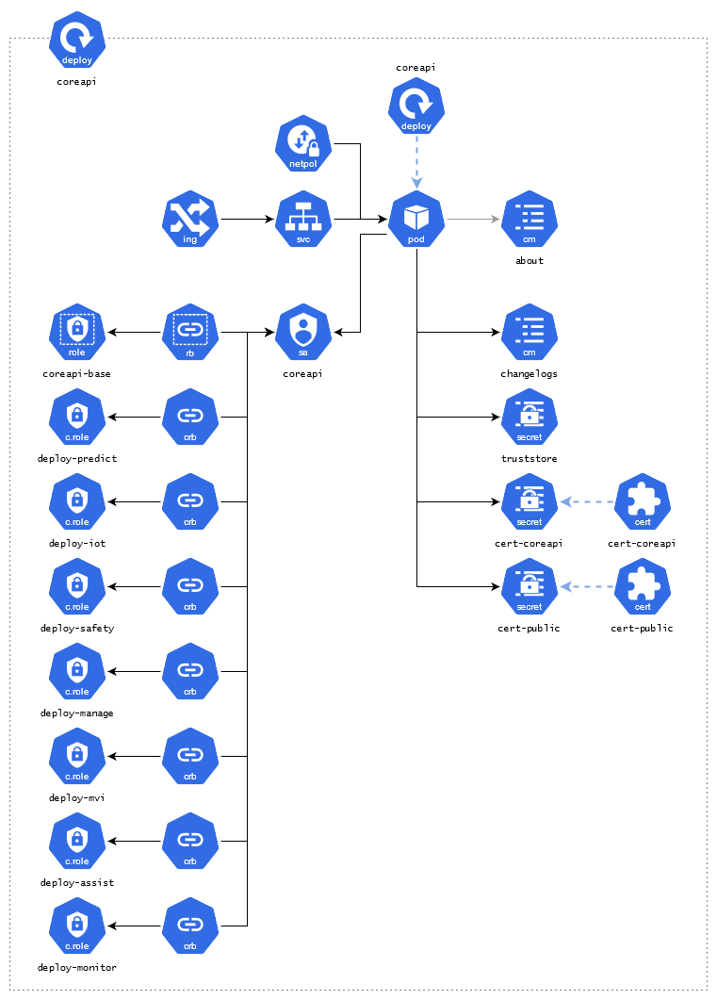
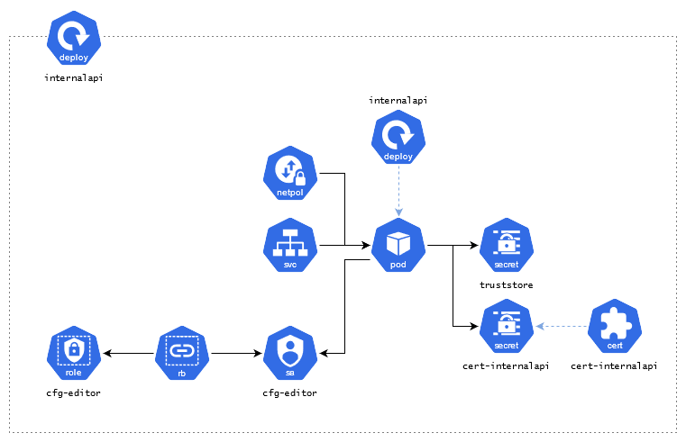
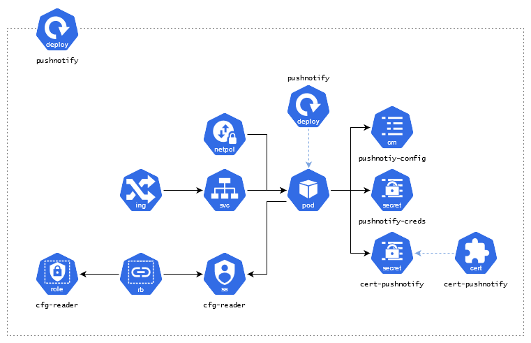
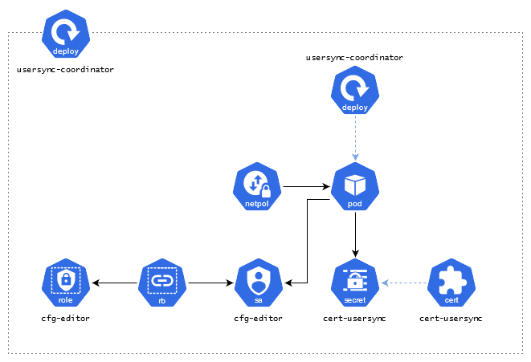
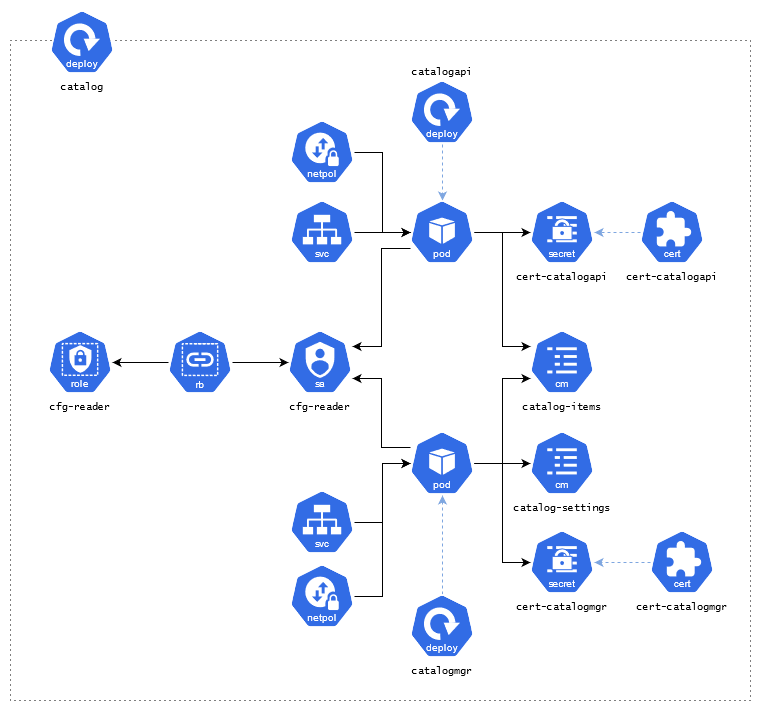
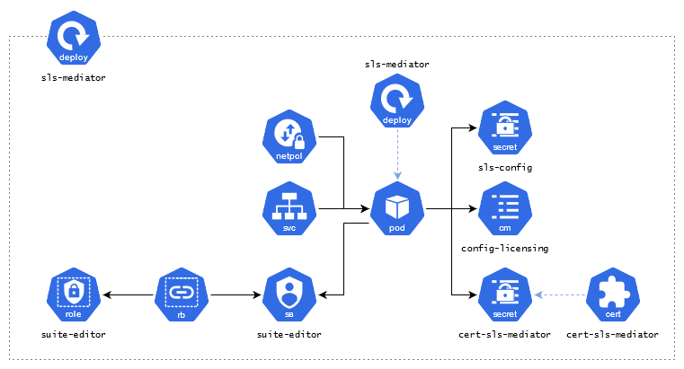

MAS Core Explained
===============================================================================

- [Kubernetes Control Plane](#kubernetes-control-plane)
- [Suite Administration](#suite-administration)
- [Identity Provider](#identity-provider)
- [Catalog Management](#catalog-management)
- [Console](#console)
- [Licensing and Usage Data Collection](#licensing-and-usage-data-collection)

Kubernetes Control Plane
-------------------------------------------------------------------------------
### Controller Managers
- **ibm-mas-operator** watches `Suite.core.mas.ibm.com`, acts as the primary controller manager for an installation of the MAS core services, installing all required entity managers and provisioning the primary resources detailed on this page.
- **ibm-truststore-mgr-controller-manager** watches `Truststore.ibm-truststore-mgr.ibm.com` and manages all of the truststores in use in the core services namespace.

### Entity Managers
- **entitymgr-addons** add-ons configuration
- **entitymgr-bascfg** watches `BASCfg.config.mas.ibm.com`, manages the UDS integration with MAS.
- **entitymgr-coreidp** watches `CoreIDP.internal.mas.ibm.com`, manages the Core IDP component.
- **entitymgr-idpcfg** watches `IDPCfg.config.mas.ibm.com`, manages IDP integration with MAS.
- **entitymgr-jdbccfg** watches `JDBCCfg.config.mas.ibm.com`, manages JDBC integration with MAS, performing configuration validation.
- **entitymgr-kafkacfg** watches `KafkaCfg.config.mas.ibm.com`, manages Kafka integration with MAS, performing configuration validation.
- **entitymgr-jdbccfg** watches `MongoCfg.config.mas.ibm.com`, manages Mongo integration with MAS, performing configuration validation.
- **entitymgr-objectstorage** watches `ObjectStorageCfg.config.mas.ibm.com`, manages ObjectStorage integration with MAS, performing configuration validation.
- **entitymgr-pushnotificationcfg**, watches `PushNotificationCfg.config.mas.ibm.com`, manages PushNotification integration with MAS, performing configuration validation.
- **entitymgr-scimcfg** watches `SCIMCfg.config.mas.ibm.com`, manages SCIM (LDAP User Sync) integration with MAS, performing configuration validation and resources creation such as scimsync-agent job and scimsync liberty pod.
- **entitymgr-slscfg** watches `SLSCfg.config.mas.ibm.com`, manages SLS integration with MAS, performing configuration validation and resources creation such as licensing-mediator pod. This pod is also responsible to register the SLS client in the SLS server.
- **entitymgr-smtpcfg** watches `SMTPCfg.config.mas.ibm.com`, manages SMTP integration with MAS, performing configuration validation.
- **entitymgr-watsonstudiocfg** watches `WatsonStudioCfg.config.mas.ibm.com`, manages Watson Studio integration with MAS, performing configuration validation.
- **entitymgr-ws** watches `Workspace.core.mas.ibm.com`, manages Workspace creation in MAS.

Suite Administration
-------------------------------------------------------------------------------
### Core API
The **coreapi** deployment provides a RESTful API to support management of the application suite, as an alternative to working directly with Kubernetes resources natively.  The API is made available on the route `https://api.{masdomain}`.

#### Deployment Topology

### Internal API
The **internalapi** deployment provides an internal API available to applications in the suite, for example, user management. Notes, this is used by internal components only. Application to application communication.

#### Deployment Topology

### Mobile API
The **mobileapi** deployment provides the backend for the mobile application package API, serving up the navigator application package. Other implementations of the mobile API exist in each application that supported mobile application packages, Core API controls access to these backend services.

#### Deployment Topology

### Monitoring Agent
The **monagent-mas** deployment is responsible for tracking the health of the core services, it reports status to the Suite status sub-resource broken down into three categories:

- Mongo configuration status
- SLS integration status
- UDS integration status

### PNS Integration
The **pushnotifications** deployment provides support for integration to an external push notification service (PNS).  PNS support is an optional extension configured by a system administrator, enabling push notification support across MAS applications; it is available at **https://api.{{domain}}/pushnotification** only if the system scope **PushNotificationCfg** resource has been created.

#### Deployment Topology

Identity Provider
-------------------------------------------------------------------------------
### Core IDP
The **coreidp** deployment serves as the identity provider for all applications across Maximo Application Suite.

### Core IDP Login
The **coreidp-login** deployment hosts the authentication login screens and superuser login logic for Maximo Application Suite.  This is not meant to be a MAS endpoint but used as part of the redirect during MAS authentication flow.  The service is available on the route `https://auth.{masdomain}`.

### Group Sync Coordinator
The **groupsync-coordinator** deployment is responsible for coordinating user group synchronization across all installed applications.

### User Sync Coordinator
The **usersync-coordinator** deployment is responsible for coordinating user synchronization across all installed Applications.

#### Deployment Topology

Catalog Management
-------------------------------------------------------------------------------
The MAS Catalog acts as the mechanism for customers to discover the resources in MAS that they are interested in, it allows the suite to abstract the actual resource (ie implementation) of a capability away from how it is presented as a catalog item.

### Catalog API
The **catalogapi** deployment provides read access to the catalog inventory.  The catalog API is exposed via endpoints in [Core API](#core-api) which proxy requests to the internal catalog API service.

### Catalog Manager
The **catalogmanager** deployment provides internal inventory management and AppPoint reservation APIs.

Console
-------------------------------------------------------------------------------
### Admin Dashboard
The **admin-dashboard** deployment provides the adminstration console available on the route `https://admin.{masdomain}`.

### Suite Homepage
The **homepage** deployment provides the primary homescreen for the suite, available on the route `https://home.{masdomain}`.

### Application Navigator
The **navigator** deployment serves the application navigator available at `https://{workspace}.home.{masdomain}`.

Licensing and Usage Data Collection
-------------------------------------------------------------------------------
### Account AppPoints Reporter
The **accapppoints** deployment submits events to IBM User Data Services (UDS) on an hourly basis.  It obtains and converts data from the Suite Licensing Service:

- AppPoint reports are converted to account contractual usage events
- License usage reports are converted to account adoption usage events

### Adoption Usage API
The **adoptionusageapi** deployment provides an internal API which enables applications in the suite to report metrics that are used to generate AppPoint and License usage reports.

### Adoption Usage Reporter
The **adoptionusage-reporter** deployment pulls the data related to adoption of different applications by users. It gathers data in terms of number of users and total AppPoints of these users who login to each of the MAS applications, whenever the users login to these applications.

This application runs as a cronjob and sends this data to IBM User Data Services (UDS). UDS in turn sends this data to the IBM growth stack to provide IBM an insight into how customers are using the application suite.

### SLS Mediator
The **licensing-mediator** deployment provides internal APIs that act as the bridge between the MAS installation and the Suite License Service (SLS). It will also periodically run a synchronization process which ensures licensing infromation in the user regsitry and in SLS are in alignment.

#### Deployment Topology

### Milestones API
The **milestonesapi** deployment is responsible for reporting critical user events, known as "milestones", to IBM User Data Services (UDS). UDS forwards these events into the IBM Growth Stack, which includes tools to help IBM gain insight into customer usage and assist with campaign administration.

#### Deployment Topology

