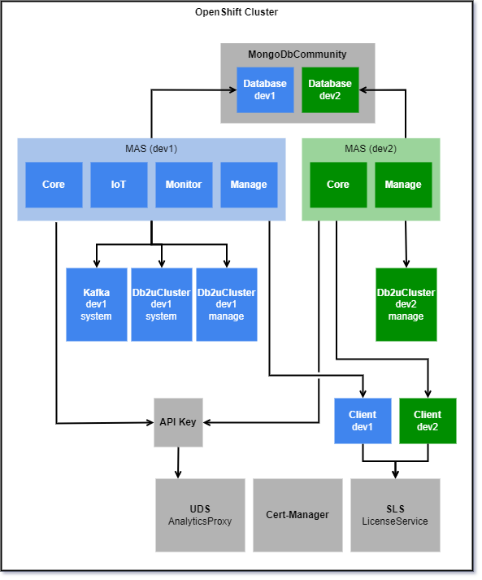
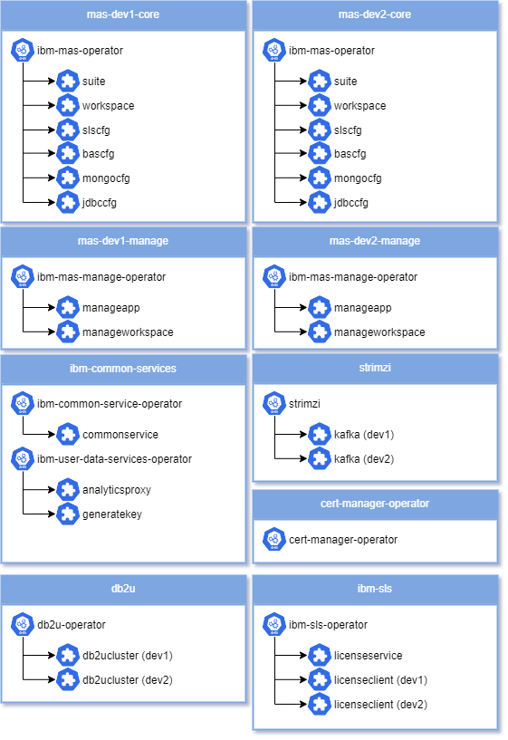

## Deployment Topology

## Overview
- Multiple instances of MAS are supported on a single OpenShift cluster, the instances do not have to be on the same release, but **there must be no more than 1 minor version difference between the oldest and newest versions installed**.
- A single MongoDb cluster will be created using the the `MongoDbCommunity` CRD, each MAS instance will have it's own database in the MongoDb cluster.
    - The cluster will be named `mas-mongo-ce`
- Multiple Db2 clusters will be created using the IBM Db2 Universal Operator, each hosting a single database.  Depending on the settings chosen a MAS instance may be configured the use up to two `Db2uCluster` instances.
    - A shared system database will be named `mas-{instanceId}-system`
    - A dedicated manage database will be named `mas-{instanceId}-{workspaceId}-manage`
- Multiple `Kafka` clusters will be created using either Strimzi or Red Hat AMQ Streams operators, one for each MAS instance.
    - The instance will be named `mas-{instanceId}-system`
- A single SLS `LicenseService` instance will be created, all MAS instances in the cluster will share the same pool of AppPoints from a single license file loaded into SLS.  Each MAS instance is registered to SLS independently, uniquely identifying it to SLS.
- A single UDS `AnalyticsProxy` instance will be created, all MAS instaled in the cluster will be configured to report to this instance using a shared API key.

## High-Level View
Multiple instances of IBM Maximo Application Suite can be installed into a single OpenShift Cluster.  The diagram below details the reference topology that will be created using the MAS CLI.

## Operator View
An alternate way to look at the deployment is based on the placement of operators and key custom resources into namespaces.  The diagram below does not show every single custom resource that can be created as part of installing and configuration IBM Maximo Application Suite, but it does cover all the **key** resources directly created during the install:

!!! tip
    For more details on the operators and custom resources available refer to the [cluster extensions reference material](cluster-extensions.md).

