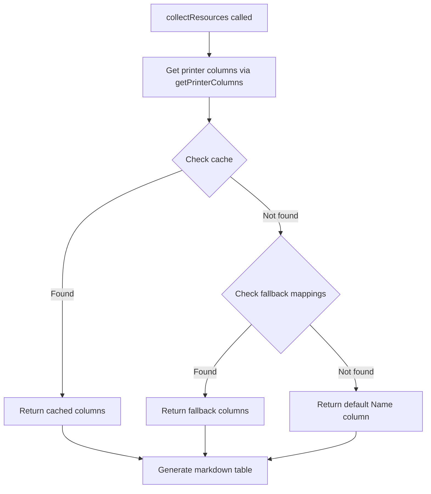

# CRD Processor

## Architecture Overview

The column selection system consists of three main components:

1. **CRD Processor** ([`crd_processor.py`](crd_processor.py)) - Extracts and caches printer columns from CRDs
2. **Resource Collector** ([`resources.py`](resources.py)) - Uses printer columns to generate markdown tables
3. **Fallback System** - Provides hardcoded columns for built-in Kubernetes resources

## Column Selection Flow



## Custom Resources with CRDs

### Discovery Process

1. **CRD Loading** (`processCRDs` function):
   - Loads all CustomResourceDefinitions from cluster
   - Iterates through each CRD's versions
   - Extracts `additionalPrinterColumns` from served versions
   - Caches columns by `(kind, apiVersion)` tuple

2. **Column Extraction**:
   ```python
   additionalPrinterColumns = version.get("additionalPrinterColumns", [])
   for col in additionalPrinterColumns:
       printerColumn = PrinterColumn(
           name=col.get("name", ""),
           type=col.get("type", "string"),
           jsonPath=col.get("jsonPath", ""),
           description=col.get("description", ""),
           priority=col.get("priority", 0),
       )
   ```

3. **Cache Storage**:
   - Stored in global `_printerColumnsCache` dictionary
   - Key: `(kind, apiVersion)` tuple
   - Value: List of `PrinterColumn` objects

### Column Properties

Each `PrinterColumn` contains:
- **name**: Display name in table header
- **type**: Data type (string, integer, date, boolean)
- **jsonPath**: JSONPath expression to extract value from resource
- **description**: Human-readable description (not used in output)
- **priority**: Display priority (0=always shown, higher values for `-o wide`)

### Value Extraction

Values are extracted using `extractValueFromJsonPath`:
- **Simple paths**: Direct dictionary traversal (e.g., `.metadata.name`)
- **Array indices**: Supports bracket notation (e.g., `.status.conditions[0].status`)
- **Filter expressions**: Uses `jsonpath_ng` library for complex queries (e.g., `.status.conditions[?(@.type=="Ready")].status`)

## Built-in Resources without CRDs

### Fallback System

When a resource is not found in the cache, `_getFallbackColumns` provides hardcoded columns for common Kubernetes resources.

### Supported Resource Types

The fallback system includes 27 resource types across 6 categories:

1. **Core Resources** (v1):
   - Pod, Service, Namespace, ConfigMap, Secret, ServiceAccount, PersistentVolumeClaim, Node

2. **Apps Resources** (apps/v1):
   - Deployment, StatefulSet, DaemonSet, ReplicaSet

3. **Batch Resources** (batch/v1):
   - Job, CronJob

4. **RBAC Resources** (rbac.authorization.k8s.io/v1):
   - Role, RoleBinding, ClusterRole, ClusterRoleBinding

5. **Networking Resources** (networking.k8s.io/v1):
   - Ingress

6. **Storage Resources** (storage.k8s.io/v1):
   - StorageClass

7. **OpenShift Resources**:
   - ClusterVersion (config.openshift.io/v1)
   - Infrastructure (config.openshift.io/v1)

8. **OLM Resources** (operators.coreos.com/v1alpha1):
   - CatalogSource, Subscription, InstallPlan, ClusterServiceVersion, PackageManifest

### Fallback Column Patterns

Common patterns across fallback definitions:

1. **Name Column**: Always first, always `.metadata.name`
2. **Status/State**: Usually second column, varies by resource type
3. **Created Column**: Almost always last, uses `.metadata.creationTimestamp`
4. **Resource-Specific**: Middle columns vary based on resource semantics

Example - Pod fallback (lines 153-159):
```python
("Pod", "v1"): [
    PrinterColumn("Name", "string", ".metadata.name"),
    PrinterColumn("Ready", "string", ".status.containerStatuses[0].ready"),
    PrinterColumn("Status", "string", ".status.phase"),
    PrinterColumn("Restarts", "integer", ".status.containerStatuses[0].restartCount"),
    PrinterColumn("Created", "date", ".metadata.creationTimestamp"),
]
```

## Default Behavior

When neither CRD columns nor fallback columns are available, the system returns a single default column:

```python
return [PrinterColumn(name="Name", type="string", jsonPath=".metadata.name")]
```

This ensures every resource type can be displayed, even if only by name.

## Markdown Table Generation

The `_writeMarkdownIndex` function in `resources.py` generates markdown tables:

1. **Header Generation** (lines 188-192):
   - Uses column names from printer columns
   - Creates separator row with `---`

2. **Value Extraction** (lines 199-202):
   - Iterates through resources
   - Extracts values using JSONPath from each column
   - Escapes pipe characters to prevent table corruption
