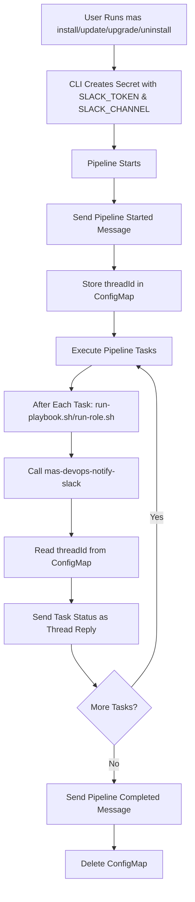
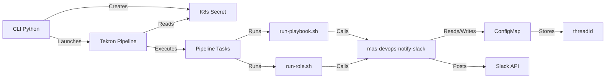

# CLI Slack Integration - Implementation Plan

## Overview

This document outlines the implementation plan for integrating Slack notifications into the MAS CLI Tekton pipelines. The integration will provide real-time notifications for cluster provisioning, installation, update, upgrade, and uninstall operations.

## Architecture

### High-Level Flow



### Component Interactions



## Implementation Details

### 1. Python-Devops Repository Changes

#### 1.1 New Function: `notifyAnsibleComplete()`

**Location:** `../python-devops/bin/mas-devops-notify-slack`

**Purpose:** Send Slack notifications after Ansible playbook/role execution

**Parameters:**
- `--action`: `ansible-complete`
- `--rc`: Return code from ansible execution (0=success, non-zero=failure)
- `--task-name`: Name of the task/role that completed
- `--pipeline-name`: Name of the pipeline (install/update/upgrade/uninstall)
- `--instance-id`: MAS instance ID (optional)

**Environment Variables Required:**
- `SLACK_TOKEN`: Slack bot token
- `SLACK_CHANNEL`: Target Slack channel(s)
- `PIPELINE_NAMESPACE`: Kubernetes namespace for ConfigMap operations
- `PIPELINERUN_NAME`: Unique identifier for this pipeline run

**Behavior:**
1. Check if this is the first task (no ConfigMap exists)
   - If yes: Send "Pipeline Started" message, create ConfigMap with threadId
2. If ConfigMap exists: Read threadId
3. Send task completion message as thread reply
4. Update ConfigMap with latest status

**ConfigMap Structure:**
```yaml
apiVersion: v1
kind: ConfigMap
metadata:
  name: slack-thread-{pipelinerun-name}
  namespace: {pipeline-namespace}
data:
  threadId: ""
  channel: ""
  pipelineName: "mas-install"
  startTime: "2026-01-27T19:00:00Z"
```

#### 1.2 Thread Management Functions

**New Functions in `slack.py`:**
- `createThreadConfigMap()`: Create ConfigMap to store thread information
- `getThreadConfigMap()`: Retrieve thread information from ConfigMap
- `deleteThreadConfigMap()`: Clean up ConfigMap after pipeline completion

### 2. CLI Repository Changes

#### 2.1 CLI Command Updates

**Files to Modify:**
- [`python/src/mas/cli/install/argParser.py`](python/src/mas/cli/install/argParser.py)
- [`python/src/mas/cli/update/argParser.py`](python/src/mas/cli/update/argParser.py)
- [`python/src/mas/cli/upgrade/argParser.py`](python/src/mas/cli/upgrade/argParser.py)
- [`python/src/mas/cli/uninstall/argParser.py`](python/src/mas/cli/uninstall/argParser.py)

**New Arguments:**
```python
slackArgGroup = parser.add_argument_group(
    "Slack Notifications",
    "Configure Slack notifications for pipeline events"
)
slackArgGroup.add_argument(
    "--slack-token",
    required=False,
    help="Slack bot token for sending notifications"
)
slackArgGroup.add_argument(
    "--slack-channel",
    required=False,
    help="Slack channel(s) for notifications (comma-separated for multiple channels)"
)
```

**Environment Variable Support:**
- If `--slack-token` not provided, check `SLACK_TOKEN` env var
- If `--slack-channel` not provided, check `SLACK_CHANNEL` env var

#### 2.2 Secret Creation

**Files to Modify:**
- [`python/src/mas/cli/install/app.py`](python/src/mas/cli/install/app.py)
- Similar changes in update/upgrade/uninstall apps

**New Method:**
```python
def createSlackSecret(self):
    """Create Kubernetes secret with Slack credentials if provided"""
    slackToken = self.getParam('slack_token') or os.getenv('SLACK_TOKEN')
    slackChannel = self.getParam('slack_channel') or os.getenv('SLACK_CHANNEL')
    
    if slackToken and slackChannel:
        # Create secret in pipeline namespace
        secretData = {
            'SLACK_TOKEN': slackToken,
            'SLACK_CHANNEL': slackChannel
        }
        # Use existing secret creation pattern from prepareInstallSecrets()
```

#### 2.3 Tekton Pipeline Parameters

**File to Modify:** [`tekton/src/params/common.yml.j2`](tekton/src/params/common.yml.j2)

**New Parameters:**
```yaml
- name: slack_token
  type: string
  default: ""
  description: "Slack bot token for notifications"
- name: slack_channel
  type: string
  default: ""
  description: "Slack channel(s) for notifications"
```

#### 2.4 Common Environment Variables

**File to Modify:** [`tekton/src/tasks/common/cli-env.yml.j2`](tekton/src/tasks/common/cli-env.yml.j2)

**New Environment Variables:**
```yaml
- name: SLACK_TOKEN
  valueFrom:
    secretKeyRef:
      name: mas-devops
      key: SLACK_TOKEN
      optional: true
- name: SLACK_CHANNEL
  valueFrom:
    secretKeyRef:
      name: mas-devops
      key: SLACK_CHANNEL
      optional: true
- name: PIPELINE_NAMESPACE
  value: $(context.pipelineRun.namespace)
- name: PIPELINERUN_NAME
  value: $(context.pipelineRun.name)
```

#### 2.5 Shell Script Modifications

**File to Modify:** [`image/cli/app-root/src/run-playbook.sh`](image/cli/app-root/src/run-playbook.sh)

**Changes:**
```bash
#!/bin/bash

if [ -e "/workspace/additional-configs" ]; then
  cp /workspace/additional-configs/* /workspace/configs/
fi

if [ -e "/workspace/entitlement/entitlement.lic" ]; then
  cp /workspace/entitlement/entitlement.lic /workspace/configs/entitlement.lic
fi

source /opt/app-root/src/env.sh

# Useful for debugging permission issues
# oc whoami
# oc auth can-i --list

python3 /opt/app-root/src/register-start.py

# Capture the playbook name for notification
PLAYBOOK_NAME="$1"

ansible-playbook ibm.mas_devops."$@"
rc=$?

# Send Slack notification if configured
if [ -n "$SLACK_TOKEN" ] && [ -n "$SLACK_CHANNEL" ]; then
  python3 /opt/app-root/bin/mas-devops-notify-slack \
    --action ansible-complete \
    --rc $rc \
    --task-name "$PLAYBOOK_NAME" \
    --pipeline-name "${PIPELINE_NAME:-unknown}" \
    --instance-id "${MAS_INSTANCE_ID:-}"
fi

python3 /opt/app-root/src/save-junit-to-mongo.py
exit $rc
```

**File to Modify:** [`image/cli/app-root/src/run-role.sh`](image/cli/app-root/src/run-role.sh)

**Changes:**
```bash
#!/bin/bash

if [ -e "/workspace/additional-configs" ]; then
  cp /workspace/additional-configs/* /workspace/configs/
fi

source /opt/app-root/src/copy-certificates.sh
source /opt/app-root/src/env.sh

# Useful for debugging permission issues
# oc whoami
# oc auth can-i --list

python3 /opt/app-root/src/register-start.py

export ROLE_NAME=$1
shift

ansible-playbook ibm.mas_devops.run_role $@
rc=$?

# Send Slack notification if configured
if [ -n "$SLACK_TOKEN" ] && [ -n "$SLACK_CHANNEL" ]; then
  python3 /opt/app-root/bin/mas-devops-notify-slack \
    --action ansible-complete \
    --rc $rc \
    --task-name "$ROLE_NAME" \
    --pipeline-name "${PIPELINE_NAME:-unknown}" \
    --instance-id "${MAS_INSTANCE_ID:-}"
fi

python3 /opt/app-root/src/save-junit-to-mongo.py
exit $rc
```

#### 2.6 Pipeline Start/End Notifications

**Files to Modify:**
- [`tekton/src/pipelines/mas-install.yml.j2`](tekton/src/pipelines/mas-install.yml.j2)
- [`tekton/src/pipelines/mas-update.yml.j2`](tekton/src/pipelines/mas-update.yml.j2)
- [`tekton/src/pipelines/mas-upgrade.yml.j2`](tekton/src/pipelines/mas-upgrade.yml.j2)
- [`tekton/src/pipelines/mas-uninstall.yml.j2`](tekton/src/pipelines/mas-uninstall.yml.j2)

**Pattern:**
1. Add `PIPELINE_NAME` environment variable to all tasks
2. Existing `pipeline-start` task already exists - enhance it to send Slack notification
3. Add `pipeline-complete` task at the end with `finally` clause

### 3. FVT System Integration

**Location:** `maximoappsuite/ubi-fvt` repository (external)

**Required Change:**
Update FVT notification logic to check for `SLACK_CHANNEL` environment variable as fallback if `FVT_SLACK_CHANNEL` is not set.

**Pseudo-code:**
```python
fvt_slack_channel = os.getenv('FVT_SLACK_CHANNEL') or os.getenv('SLACK_CHANNEL')
```

## Message Format Examples

### Pipeline Started Message
```
🚀 MAS Install Pipeline Started
Instance ID: inst1
Cluster: my-cluster
Started: 2026-01-27 19:00:00 UTC
Pipeline Run: mas-install-run-abc123
```

### Task Completion Message (Thread Reply)
```
✅ Install IBM Catalogs - Success
Duration: 2m 15s
```

### Task Failure Message (Thread Reply)
```
❌ Install Cert-Manager - Failed
Duration: 5m 30s
Return Code: 1
Check logs for details
```

### Pipeline Completed Message (Thread Reply)
```
🎉 MAS Install Pipeline Completed Successfully
Total Duration: 45m 30s
Instance ID: inst1
All tasks completed successfully
```

## Testing Strategy

### Unit Tests
1. Test `notifyAnsibleComplete()` function with various scenarios
2. Test ConfigMap creation/retrieval/deletion
3. Test thread ID management

### Integration Tests
1. Use `fvt-personal` pipeline for testing
2. Test scenarios:
   - Install pipeline with Slack enabled
   - Update pipeline with Slack enabled
   - Upgrade pipeline with Slack enabled
   - Uninstall pipeline with Slack enabled
   - Pipeline with task failures
   - Multiple channel notifications

### Test Checklist
- [ ] Verify initial message is sent when pipeline starts
- [ ] Verify threadId is stored in ConfigMap
- [ ] Verify task completion messages appear as thread replies
- [ ] Verify success/failure status is correctly indicated
- [ ] Verify final completion message is sent
- [ ] Verify ConfigMap is cleaned up after completion
- [ ] Verify multiple channels receive notifications
- [ ] Verify graceful handling when SLACK_TOKEN/SLACK_CHANNEL not set

## Rollout Plan

### Phase 1: Foundation (Week 1)
- Implement `notifyAnsibleComplete()` in python-devops
- Implement ConfigMap management functions
- Add CLI parameters for Slack configuration

### Phase 2: Integration (Week 2)
- Modify run-playbook.sh and run-role.sh
- Update Tekton pipeline definitions
- Update cli-env.yml.j2

### Phase 3: Testing (Week 3)
- Extensive testing in fvt-personal
- Fix any issues discovered
- Performance validation

### Phase 4: Documentation & Rollout (Week 4)
- Document feature for internal use
- Update FVT system for alignment
- Deploy to development pipelines
- Monitor and gather feedback

## Security Considerations

1. **Secret Management**
   - Slack tokens stored in Kubernetes secrets
   - Secrets marked as optional to avoid breaking existing pipelines
   - No tokens logged or exposed in pipeline output

2. **Access Control**
   - Only authorized users can create pipelines with Slack notifications
   - Channel access controlled by Slack workspace permissions

3. **Data Privacy**
   - No sensitive data (passwords, keys) included in notifications
   - Only pipeline status and metadata shared

## Performance Impact

- Minimal: Slack API calls are asynchronous and take <1 second
- No new pods spawned (uses existing CLI container)
- ConfigMap operations are lightweight
- No impact on pipeline execution time

## Backward Compatibility

- Feature is opt-in via `--slack-token` and `--slack-channel` parameters
- Existing pipelines continue to work without modification
- If Slack credentials not provided, notifications are silently skipped
- No breaking changes to existing APIs or interfaces

## Success Criteria

1. ✅ Notifications sent for all major pipeline events
2. ✅ Threaded messages keep related notifications organized
3. ✅ Clear success/failure indicators in messages
4. ✅ No performance degradation to pipelines
5. ✅ Seamless integration with existing FVT notifications
6. ✅ Zero breaking changes to existing functionality

## Future Enhancements

1. **Rich Formatting**
   - Add more context (cluster info, versions, etc.)
   - Include links to pipeline runs in OpenShift console
   - Add emoji indicators for different task types

2. **Notification Filtering**
   - Allow users to specify which events to notify
   - Support different notification levels (verbose, normal, minimal)

3. **Multi-Channel Support**
   - Different channels for different event types
   - Escalation channels for failures

4. **Integration with Other Services**
   - Support for Microsoft Teams
   - Support for email notifications
   - Webhook support for custom integrations

## References

- [Slack Block Kit Documentation](https://api.slack.com/block-kit)
- [Tekton Pipeline Documentation](https://tekton.dev/docs/pipelines/)
- [Kubernetes ConfigMap Documentation](https://kubernetes.io/docs/concepts/configuration/configmap/)
- [MAS CLI Documentation](https://ibm-mas.github.io/cli/)